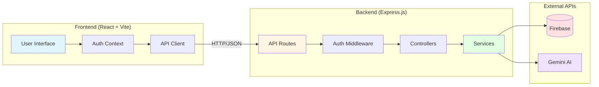
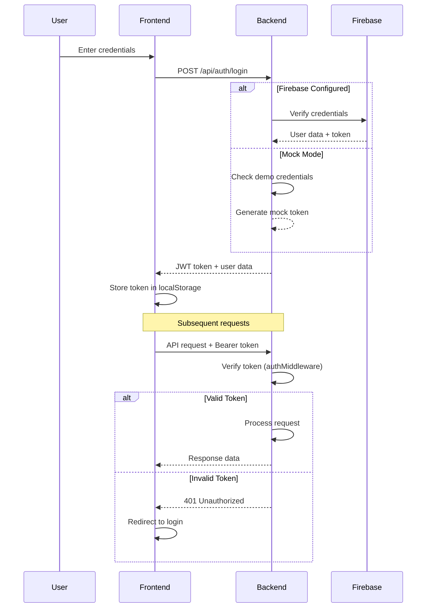
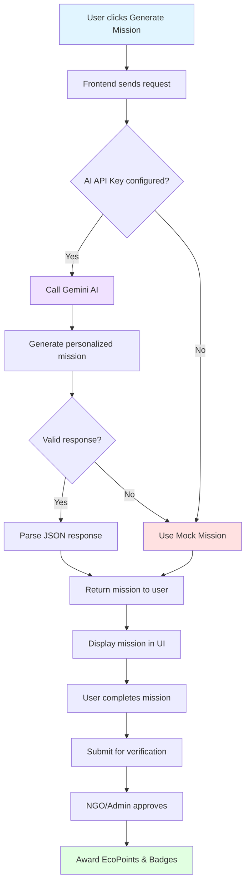
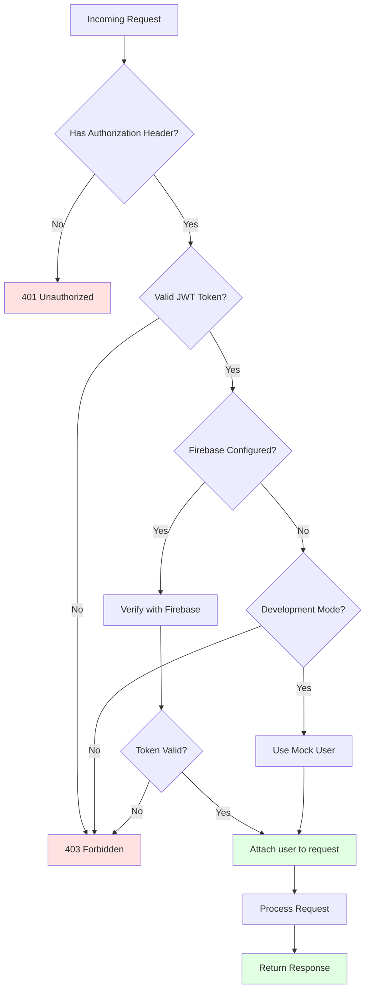

# API Architecture Overview

## System Architecture



## Authentication Flow



## API Endpoints Structure

### Authentication Endpoints
- **POST** `/api/auth/login` - User login
- **POST** `/api/auth/register` - User registration  
- **GET** `/api/auth/profile` - Get user profile (🔒 Protected)

### Mission Endpoints
- **POST** `/api/missions/generate` - Generate AI-powered mission
- **GET** `/api/missions/:id` - Get mission details
- **POST** `/api/missions/:id/complete` - Mark mission as complete (🔒 Protected)

### Gamification Endpoints
- **GET** `/api/gamification/leaderboard` - Get panchayat leaderboard
- **GET** `/api/gamification/badges` - Get user badges (🔒 Protected)
- **POST** `/api/gamification/claim-reward` - Claim reward (🔒 Protected)

### Community Endpoints
- **GET** `/api/community/feed` - Get community posts
- **POST** `/api/community/post` - Create new post (🔒 Protected)

### Verification Endpoints (Admin/NGO)
- **GET** `/api/verification/pending` - Get pending verifications (🔒 Protected)
- **POST** `/api/verification/:id/approve` - Approve mission (🔒 Protected)
- **POST** `/api/verification/:id/reject` - Reject mission (🔒 Protected)

### Government Schemes Endpoints
- **GET** `/api/schemes/recommended` - Get recommended schemes based on crop/location

### Crop Calendar Endpoints
- **GET** `/api/crops/calendar` - Get crop-specific calendar

🔒 = Requires authentication token

## Data Flow: Mission Generation



## Environment Configuration

### Development Mode
- Mock authentication enabled
- Mock AI missions
- No Firebase required
- Perfect for testing

### Production Mode
- Firebase authentication required
- Real AI mission generation
- Firestore database
- Secure JWT tokens

## Security Layers



## API Response Format

### Success Response
```json
{
  "success": true,
  "data": {
    // Response data
  }
}
```

### Error Response
```json
{
  "success": false,
  "message": "Error description",
  "error": "Detailed error (development only)"
}
```

## Rate Limiting & Performance

Currently not implemented, but recommended for production:
- Rate limiting: 100 requests/minute per IP
- Request timeout: 30 seconds
- Response caching for static data
- Database query optimization

## Monitoring & Logging

Console logging enabled for:
- ✅ Firebase initialization status
- ✅ AI API errors (with fallback)
- ✅ Authentication errors
- ✅ Server startup confirmation

For production, integrate:
- Error tracking (e.g., Sentry)
- Performance monitoring (e.g., New Relic)
- Request logging (e.g., Morgan)
- Analytics (e.g., Google Analytics)
